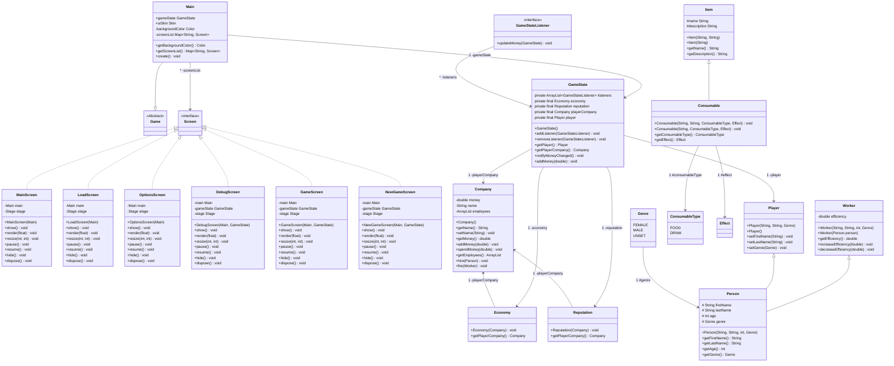

# Sudo Capitalism

A little game that started as a school project.

The code was originally written (by me) in a homebrew language from my university as a project.
I then translated it into Java, but it wasn't that good.

This is now the second iteration of the game in Java.

The game is using [LibGDX](https://libgdx.com/) to run.

## Class diagram


```mermaid
classDiagram
    
    class Game {
        <<Abstract>>
    }

    class Screen {
        <<interface>>
    }

    class Main {
        +gameState GameState
        +uiSkin Skin
        -backgroundColor Color
        -screenList Map~String, Screen~
        
        +getBackgroundColor() Color
        +getScreenList() Map~String, Screen~
        +create() void
    }

    class MainScreen {
        -Main main
        -Stage stage
        
        +MainScreen(Main)
        
        +show() void
        +render(float) void
        +resize(int, int) void
        +pause() void
        +resume() void
        +hide() void
        +dispose() void
    }

    class LoadScreen {
        -Main main
        -Stage stage
        
        +LoadScreen(Main)
        
        +show() void
        +render(float) void
        +resize(int, int) void
        +pause() void
        +resume() void
        +hide() void
        +dispose() void
    }

    class OptionsScreen {
        -Main main
        -Stage stage
        
        +OptionsScreen(Main)
        
        +show() void
        +render(float) void
        +resize(int, int) void
        +pause() void
        +resume() void
        +hide() void
        +dispose() void
    }
    
    class DebugScreen {
        -main Main
        -gameState GameState
        -stage Stage
        
        +DebugScreen(Main, GameState)
        
        +show() void
        +render(float) void
        +resize(int, int) void
        +pause() void
        +resume() void
        +hide() void
        +dispose() void
    }

    class GameScreen {
        -main Main
        -gameState GameState
        -stage Stage

        +GameScreen(Main, GameState)
        
        +show() void
        +render(float) void
        +resize(int, int) void
        +pause() void
        +resume() void
        +hide() void
        +dispose() void
    }

    class NewGameScreen {
        -main Main
        -gameState GameState
        -stage Stage

        +NewGameScreen(Main, GameState)

        +show() void
        +render(float) void
        +resize(int, int) void
        +pause() void
        +resume() void
        +hide() void
        +dispose() void
    }

    class Genre {
        FEMALE
        MALE
        UNSET
    }

    class Person {
        # String firstName
        # String lastName
        # int age
        # Genre genre
        +Person(String, String, int, Genre)
        +getFirstName() String
        +getLastName() String
        +getAge() int
        +getGenre() Genre
    }

    class Player {
        +Player(String, String, Genre)
        +Player()
        +setFirstName(String) void
        +setLastName(String) void
        +setGenre(Genre) void
    }
    
    class Worker {
        -double efficiency
        
        +Worker(String, String, int, Genre)
        +Worker(Person person)
        
        +getEfficiency() double
        +increaseEfficiency(double) void
        +decreaseEfficiency(double) void
    }

    class Company {
        -double money
        -String name
        -ArrayList<Worker> employees
        
        +Company()

        +getName() String
        +setName(String) void
        +getMoney() double
        +addMoney(double) void
        +spendMoney(double) void
        +getEmployees() ArrayList<Worker>
        +hire(Person) void
        +fire(Worker) void
    }

    class Economy {
        +Economy(Company) void
        +getPlayerCompany() Company
    }

    class Reputation {
        +Reputation(Company) void
        +getPlayerCompany() Company
    }
    
    class GameStateListener {
        <<interface>>
        +updateMoney(GameState) void
    }

    class GameState {
        private ArrayList~GameStateListener~ listeners
        private final Economy economy
        private final Reputation reputation
        private final Company playerCompany
        private final Player player
        +GameState()
        +addListener(GameStateListener) void
        +removeListener(GameStateListener) void
        +getPlayer() Player
        +getPlayerCompany() Company
        +notifyMoneyChanged() void
        +addMoney(double) void
    }

    class ConsumableType {
        FOOD
        DRINK
    }

    class Item {
        #name String
        #description String
        +Item(String, String)
        +Item(String)
        +getName() String
        +getDescription() String
    }

    class Consumable {
        +Consumable(String, String, ConsumableType, Effect) void
        +Consumable(String, ConsumableType, Effect) void
        +getConsumableType() ConsumableType
        +getEffect() Effect
    }
    
    class Effect {}

    Main --|> Game
    
    Main --> Screen : * -screenList
    Screen <|.. MainScreen
    Screen <|.. LoadScreen
    Screen <|.. OptionsScreen
    Screen <|.. DebugScreen
    Screen <|.. GameScreen
    Screen <|.. NewGameScreen
    
    Genre --> Person :  1 #genre
    Player <|-- Person
    Worker <|-- Person

    Company <-- Reputation : 1 -playerCompany
    Company <-- Economy : 1 -playerCompany

    GameStateListener --> GameState : * -listeners
    GameState --> Economy : 1 -economy
    GameState --> Reputation : 1 -reputation
    GameState --> Company : 1 -playerCompany
    GameState --> Player : 1 -player
    
    Main --> GameState : 1 -gameState

    Item <|-- Consumable
    Consumable --> ConsumableType : 1 #consumableType
    Consumable --> Effect : 1 #effect
```

## Project structure

```
.
├── assets
│   ├── assets.txt
│   ├── libgdx.png
│   └── ui
│       ├── font.fnt
│       ├── font-list.fnt
│       ├── font-subtitle.fnt
│       ├── font-window.fnt
│       ├── Particle Park UI.atlas
│       ├── Particle Park UI.json
│       └── Particle Park UI.png
├── build
│   └── reports
│       └── problems
│           └── problems-report.html
├── build.gradle
├── core
│   ├── build
│   │   ├── classes
│   │   │   └── java
│   │   │       └── main
│   │   │           └── com
│   │   │               └── sudocapitalism
│   │   │                   ├── character
│   │   │                   │   ├── Genre.class
│   │   │                   │   ├── Person.class
│   │   │                   │   ├── Player.class
│   │   │                   │   └── worker
│   │   │                   │       ├── InventoryManager.class
│   │   │                   │       ├── MarketingManager.class
│   │   │                   │       ├── ProductionManager.class
│   │   │                   │       └── Worker.class
│   │   │                   ├── company
│   │   │                   │   ├── Company.class
│   │   │                   │   └── CompanyListener.class
│   │   │                   ├── gameState
│   │   │                   │   ├── Economy
│   │   │                   │   │   └── Economy.class
│   │   │                   │   ├── GameState.class
│   │   │                   │   ├── GameStateListener.class
│   │   │                   │   └── Reputation
│   │   │                   │       └── Reputation.class
│   │   │                   ├── item
│   │   │                   │   ├── consumable
│   │   │                   │   │   ├── Consumable.class
│   │   │                   │   │   └── ConsumableType.class
│   │   │                   │   ├── Effect.class
│   │   │                   │   └── Item.class
│   │   │                   ├── Main.class
│   │   │                   └── ui
│   │   │                       ├── game
│   │   │                       │   ├── DebugScreen$1.class
│   │   │                       │   ├── DebugScreen$2.class
│   │   │                       │   ├── DebugScreen.class
│   │   │                       │   └── MainScreen.class
│   │   │                       └── menu
│   │   │                           ├── HomeScreen$1.class
│   │   │                           ├── HomeScreen$2.class
│   │   │                           ├── HomeScreen$3.class
│   │   │                           ├── HomeScreen.class
│   │   │                           ├── LoadScreen$1.class
│   │   │                           ├── LoadScreen$2.class
│   │   │                           ├── LoadScreen$3.class
│   │   │                           ├── LoadScreen.class
│   │   │                           ├── NewGameScreen$1.class
│   │   │                           ├── NewGameScreen$2.class
│   │   │                           ├── NewGameScreen.class
│   │   │                           └── OptionsScreen.class
│   │   ├── generated
│   │   │   └── sources
│   │   │       ├── annotationProcessor
│   │   │       │   └── java
│   │   │       │       └── main
│   │   │       └── headers
│   │   │           └── java
│   │   │               └── main
│   │   ├── libs
│   │   │   └── core-1.0.0.jar
│   │   └── tmp
│   │       ├── compileJava
│   │       │   ├── compileTransaction
│   │       │   │   ├── backup-dir
│   │       │   │   └── stash-dir
│   │       │   │       ├── Main.class.uniqueId0
│   │       │   │       └── MainScreen.class.uniqueId1
│   │       │   └── previous-compilation-data.bin
│   │       └── jar
│   │           └── MANIFEST.MF
│   ├── build.gradle
│   └── src
│       └── main
│           └── java
│               └── com
│                   └── sudocapitalism
│                       ├── character
│                       │   ├── Genre.java
│                       │   ├── Person.java
│                       │   ├── Player.java
│                       │   └── worker
│                       │       ├── InventoryManager.java
│                       │       ├── MarketingManager.java
│                       │       ├── ProductionManager.java
│                       │       └── Worker.java
│                       ├── company
│                       │   ├── Company.java
│                       │   └── CompanyListener.java
│                       ├── gameState
│                       │   ├── Economy
│                       │   │   └── Economy.java
│                       │   ├── GameState.java
│                       │   ├── GameStateListener.java
│                       │   └── Reputation
│                       │       └── Reputation.java
│                       ├── item
│                       │   ├── consumable
│                       │   │   ├── Consumable.java
│                       │   │   └── ConsumableType.java
│                       │   ├── Effect.java
│                       │   ├── equipment
│                       │   │   ├── clothing
│                       │   │   └── tool
│                       │   └── Item.java
│                       ├── Main.java
│                       └── ui
│                           ├── game
│                           │   ├── DebugScreen.java
│                           │   └── MainScreen.java
│                           └── menu
│                               ├── HomeScreen.java
│                               ├── LoadScreen.java
│                               ├── NewGameScreen.java
│                               └── OptionsScreen.java
├── gradle
│   ├── gradle-daemon-jvm.properties
│   └── wrapper
│       ├── gradle-wrapper.jar
│       └── gradle-wrapper.properties
├── gradle.properties
├── gradlew
├── gradlew.bat
├── LICENSE
├── lwjgl3
│   ├── build
│   │   ├── classes
│   │   │   └── java
│   │   │       └── main
│   │   │           └── com
│   │   │               └── sudocapitalism
│   │   │                   └── lwjgl3
│   │   │                       ├── Lwjgl3Launcher.class
│   │   │                       └── StartupHelper.class
│   │   ├── generated
│   │   │   └── sources
│   │   │       ├── annotationProcessor
│   │   │       │   └── java
│   │   │       │       └── main
│   │   │       └── headers
│   │   │           └── java
│   │   │               └── main
│   │   ├── resources
│   │   │   └── main
│   │   │       ├── assets.txt
│   │   │       ├── atlas
│   │   │       ├── data
│   │   │       │   └── people.csv
│   │   │       ├── libgdx128.png
│   │   │       ├── libgdx16.png
│   │   │       ├── libgdx32.png
│   │   │       ├── libgdx64.png
│   │   │       ├── libgdx.png
│   │   │       └── ui
│   │   │           ├── expeeui
│   │   │           ├── font.fnt
│   │   │           ├── font-list.fnt
│   │   │           ├── font-subtitle.fnt
│   │   │           ├── font-window.fnt
│   │   │           ├── Particle Park UI.atlas
│   │   │           ├── Particle Park UI.json
│   │   │           └── Particle Park UI.png
│   │   └── tmp
│   │       └── compileJava
│   │           └── previous-compilation-data.bin
│   ├── build.gradle
│   ├── icons
│   │   ├── logo.icns
│   │   ├── logo.ico
│   │   └── logo.png
│   ├── nativeimage.gradle
│   └── src
│       └── main
│           ├── java
│           │   └── com
│           │       └── sudocapitalism
│           │           └── lwjgl3
│           │               ├── Lwjgl3Launcher.java
│           │               └── StartupHelper.java
│           └── resources
│               ├── data
│               │   └── people.csv
│               ├── libgdx128.png
│               ├── libgdx16.png
│               ├── libgdx32.png
│               └── libgdx64.png
├── README.md
└── settings.gradle
```

## Changelog

**v0.2.8**

- The UI has been separated again to make it even easier to maintain in the future.
- Dedicated listeners are being added to some classes like `Production` or `Company` to make the code lighter.

**v0.2.7**

- Listeners are being separated to make the code easier to maintain.

**v0.2.6**

- The UI refactor has progressed with the `SideBar` class.

**v0.2.5**

- Replaced public attributes `main.uiSkin` and `main.backgroundColor` with proper getters and setters.

**v0.2.4**

- UI split in smaller tables to make it more modular.

**v0.2.3**

- The UI is undergoing a refactor to make it cleaner.
- A `TopBar` class has been added

**v0.2.2**

- The production leveling system is now working.

**v0.2.1**

- Added a base of the production system to the company.

**v0.2.0**

- Major code refactoring.
- Removed unnecessary listeners.

**v0.1.7**

- Changed the UI of the game.

**v0.1.6**

- Removed hardcoded values selection in the SelectBox of the `OptionsScreen` class for a dynamic approach.
- Added documentation to `ColorWrapper`, `CompanyListener` and `GameStateListener`.

**v0.1.5**

- The UI now uses [Raymond Buckley's Particle Park UI Skin](https://ray3k.wordpress.com/particle-park-ui-skin-for-scene2d-ui/).
- A new layout has been implemented.

**v0.1.4**

- A raw game UI has been implemented instead of the `DebugScreen`.

**v0.1.3**

- Added a `toString` override in the `Worker` class to display its stats.
- Added a `toString` override in the `Company` class to display its employees.
- Documentation added to the `GameState` class.

**v0.1.2**

- Workers now have a pseudo randomized efficiency assigned on creation.
- The efficiency can be increased and decreased at a given rate.

**v0.1.1**

- The `Company` class received new methods to handle a basic gameplay
- Javadoc added to the `Worker` class.

**v0.1.0**

- A `DebugScreen` has been added when starting a new game to check if the backend is running properly 
- A `MainScreen` has been added to be the screen that handles the game in the future.
- A `GameState` class has been implemented to handle the backend and the game loop, helped by the `GameStateListener` class.
- The `HomeScreen` and `LoadScreen` have been updated.
- A `NewGameScreen` has been added when pressing on new game to init `GameState`.
- An empty `OptionsScreen` has been created to handle settings in the future.
- The backend is being implemented with classes such as `Person`, `Economy`...

**v0.0.1**

- A `HomeScreen` class has been created to display a proper home screen.
- A `LoadScreen`  class has been created to display the ability to load or start a new game.
- The game can be exited properly.

**v0.0.1**

- Modified the `Lwjgl3Launcher.java` to remove unnecessary comments.

**Initial commit**

- The game can be run, for now it is just displaying the [LibGDX](https://libgdx.com/) logo.

## Licences

[](https://www.gnu.org/licenses/agpl-3.0)
[](https://creativecommons.org/licenses/by-nc/4.0/)

The code is under the AGPL v3 license.
All the assets of the game are under the CC BY-NC license, except the UI Skin as it's not made by me.
